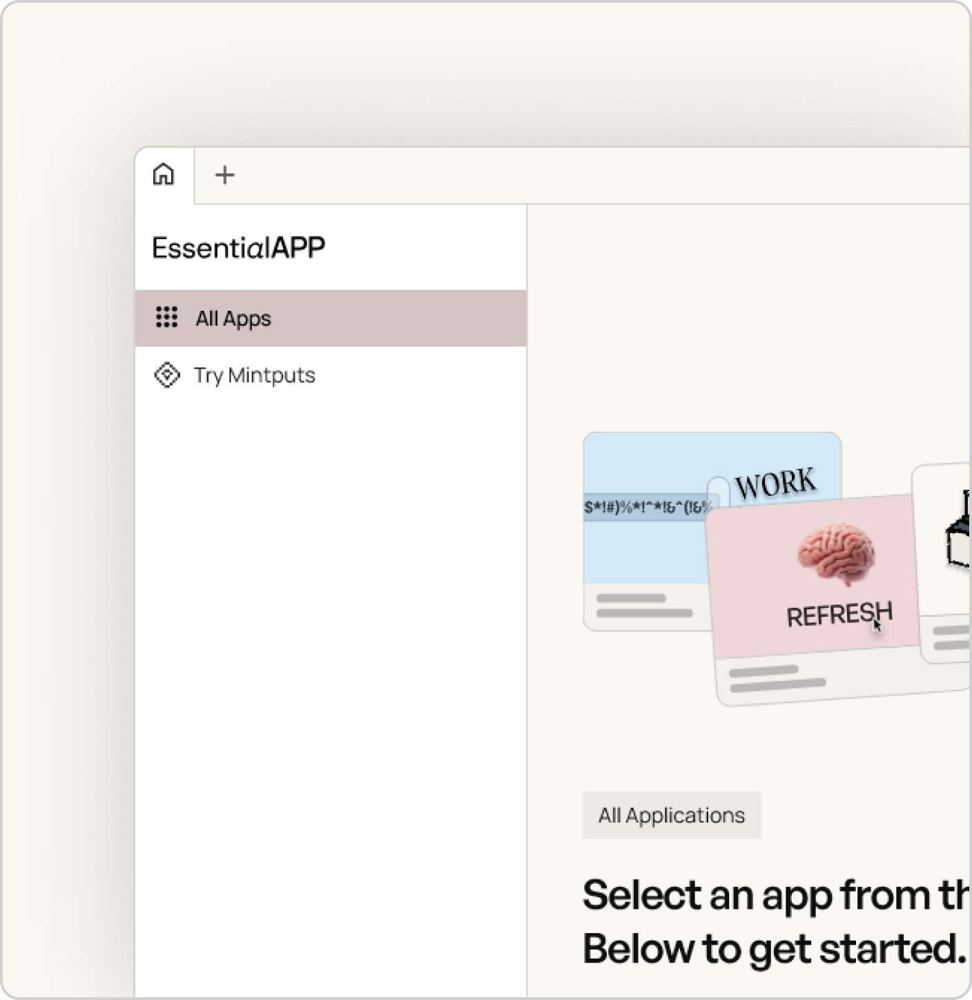

<div align="center">
  <p align="center">
<!--      -->
    
  </p>
  <h1 align="center">EssentialAPP</h1>

  <div style="text-align: center;">
    <a href="https://www.electronjs.org/">
      
    </a>
    <a href="#">
      
    </a>
    <a href="#">
      
    </a>
  </div>

</div>

## Overview  

**EssentialAPP** is a minimalist yet versatile Electron-powered desktop application.  
Designed with simplicity and efficiency in mind, it harnesses modern web technologies like **HTML, CSS**, and **JavaScript** to deliver essential features without consuming excessive system resources.

EssentialAPP is your **all-in-one utility app**, combining the core tools you need into one compact, easy-to-use interface. It’s not just free — it's **built for everyone**.

Whether you're using an old iMac from 2011, a budget Windows machine, or anything in between, **this app just works**. It’s lightweight, fast, and made to deliver a smooth experience across the board.

✅ **No need to worry about system specs.**  
✅ **Optimized for performance on low-end hardware.**  
✅ **Free and open-source. Always.**

---

## Key Features  

- **User-Friendly Design**  
  Clean, intuitive, and minimalistic interface that works for everyone.  

- **Lightweight**  
  Effortlessly runs even on legacy machines (macOS 10.13+, Windows 7+).  

- **Cross-Platform**  
  Fully functional on Windows, macOS, and Linux.  

- **Web-Based Core**  
  Built on vanilla HTML, CSS, and JavaScript for portability.  

- **Hotkey Support**  
  Boost productivity with shortcuts like `Ctrl+Click` and `Ctrl+Shift+N`.  

- **Custom Design Power by Mint Teams**  
  Aesthetic and modern UI manually crafted for a seamless experience.  

- **Customizable**  
  Easily modify, extend, and personalize the app to meet your needs.

### Requirements

| OS            | Minimum Version |
|---------------|------------------|
| macOS         | 10.10 (Yosemite) |
| Windows       | 7                |
| RAM           | 4 GB             |
| VRAM          | 128 MB           |

---

## key Highlights

- Ultra-light: ~28MB RAM usage on startup
- Native support for theme switching and local settings
- Optimized for older CPUs (ex: i5-7400) with ~0.1% CPU usage
- GPU-aware animations (with VRAM min config)
- Native context menus, ripple feedback, and intuitive UX
- Modular codebase for easy customization

---

## Installation  

### Clone the Repository
1. Open your terminal or command prompt.
2. Run the following command:
   ```bash
   git clone https://github.com/Peakk2011/Basic-requirement-app.git
   ```
3. Navigate to the project folder:
   ```bash
   cd Basic-requirement-app
   ```

### Download the ZIP
1. Download the ZIP file from the [EssentialAPP Repository](https://github.com/Peakk2011/Basic-requirement-app).
2. Extract the ZIP file to your desired location.

---

### Running the App

#### **Web Version**  
1. Navigate to the `src/` folder.  
2. Open `index.html` in your browser.  

#### **Desktop Version**  
1. Navigate to the project folder.  
2. Open the terminal and run the following commands:  
   ```bash
   powershell -c "irm bun.sh/install.ps1|iex" -> For windows to install bun.js
   curl -fsSL https://bun.sh/install -> For macOS to install bun.js
   bun install
   bun run start
   ```

---

## Customization & Development  

- **Modify**: Edit the `index.html` file to adjust the layout or content.  
- **Enhance**: Update styles in `style.css` to improve the design.  
- **Extend**: Add or edit functionality in `app.js` or `main.js`.  

---

## Project Structure  

```plaintext
Basic-requirement-app/
├── src/ 
│   ├── index.html    # Main HTML file
│   ├── style.css     # Stylesheet
│   └── app.js        # Frontend JavaScript logic
├── main.js           # Electron app main process
├── package.json      # Node.js project configuration
```

---

## Made By

The **Mint Team** – a small, passionate group of 3 developers  
who handled **design**, **frontend**, **frameworks**, and **packaging**.

> *"Build with Performance and quality."*  
> _Tested on many devices_

---

## License  
MIT

**License Pending**  

This is an open-source project free to edit, <br>
improve, and share the app as you needed. ✅  

---

## Stay Connected  

Follow the repository for updates, new features, <br>
And improvements. Contributions are welcome <br>
Don't forget to star the repo if you find it useful! <br>
That if you want to develop with me now contribute <br>

<a href="https://github.com/Peakk2011/Basic-requirement-app" style="text-decroation: none;">🌟 Star on GitHub</a>

## License
EssentialAPP is licensed under the GNU General Public License v3.0 — see the [LICENSE](./LICENSE) file for details.
